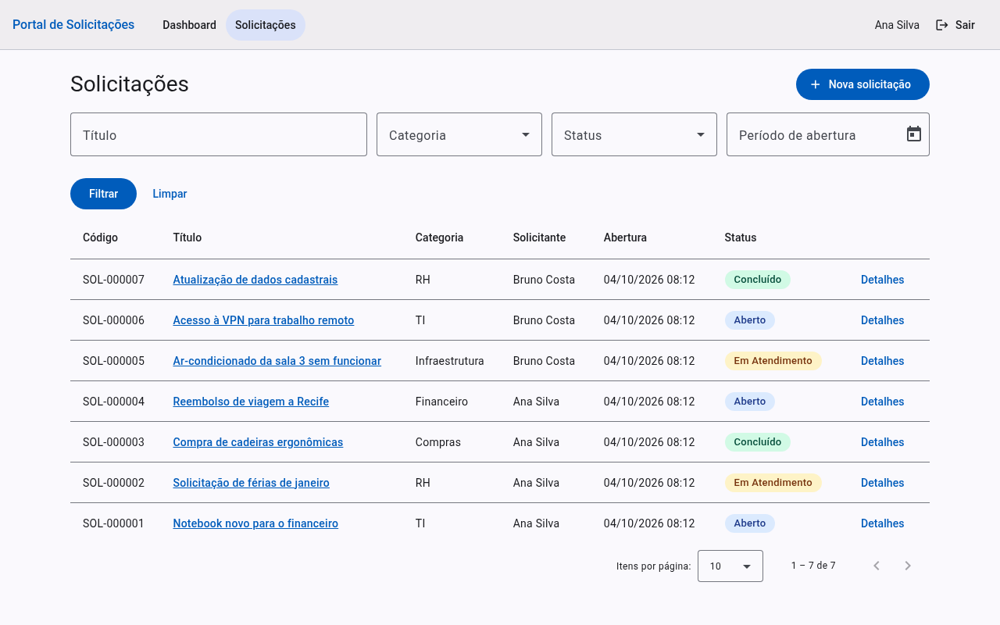
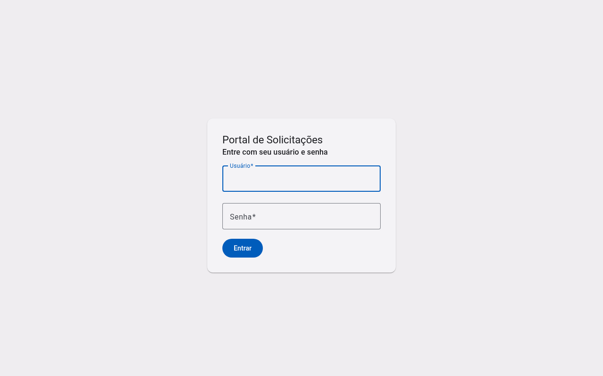
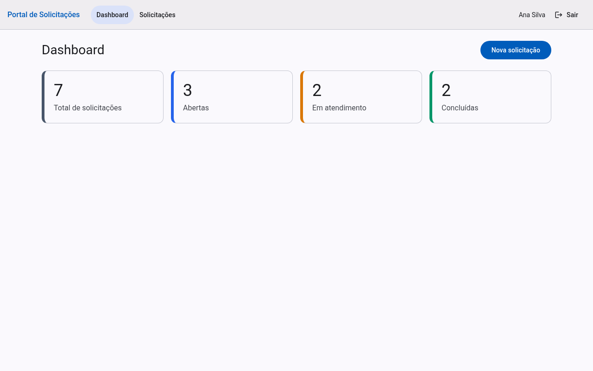
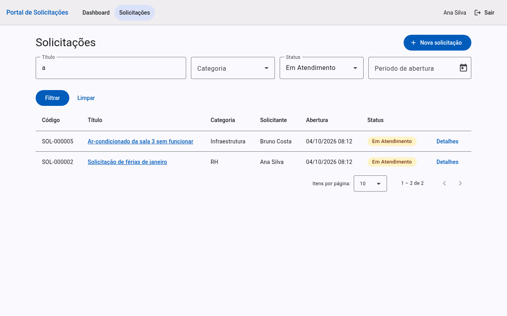
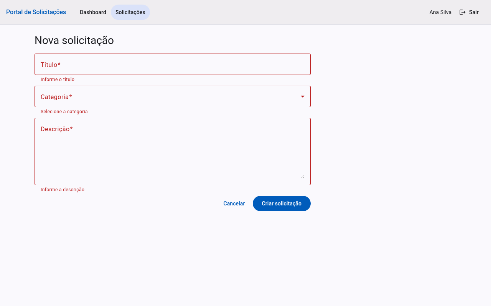
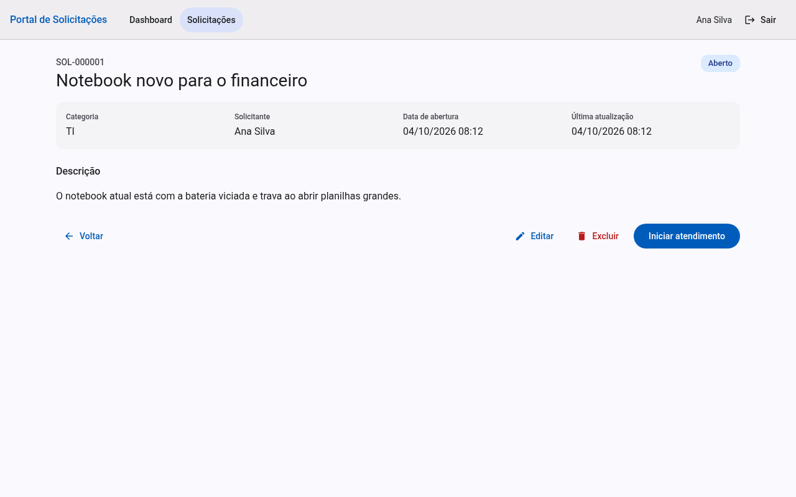
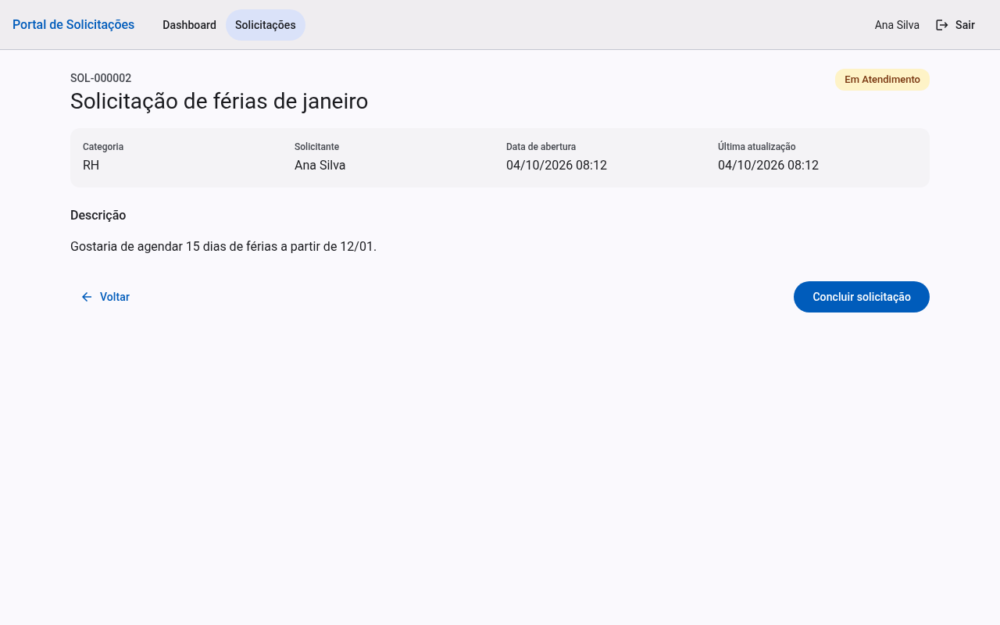
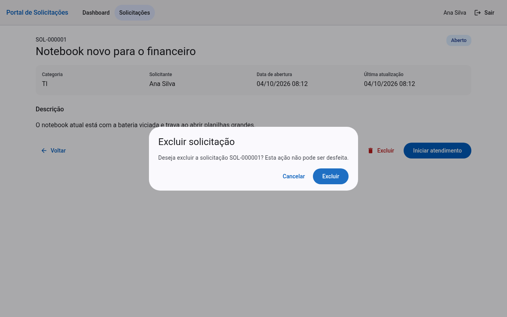
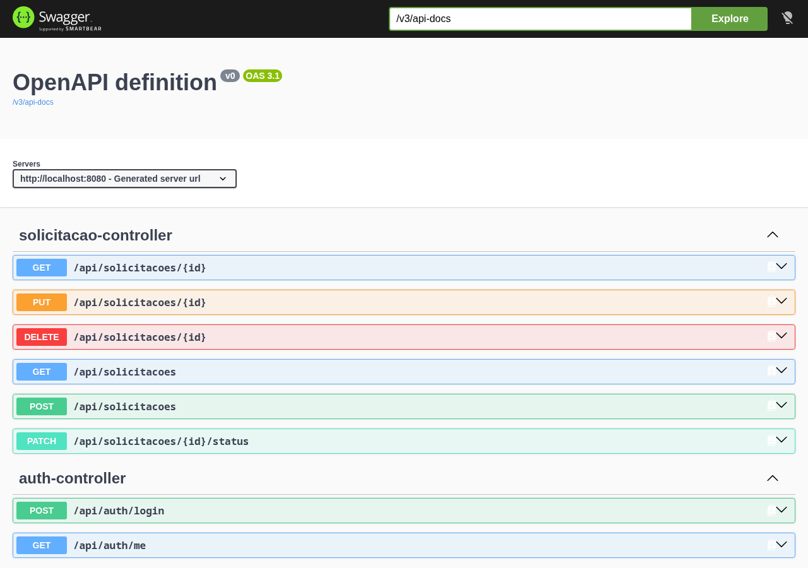

# Portal de Solicitações Internas

Mini-projeto Full Stack da 2ª etapa do processo seletivo para Desenvolvedor(a) de Sistemas Júnior da bit Soluções.
Colaboradores registram demandas internas e acompanham sua evolução (Aberto → Em Atendimento → Concluído).

| Camada | Tecnologia |
|---|---|
| Backend | Java 25, Spring Boot 4.1, Spring Data JPA, Spring Security, Flyway |
| Frontend | Angular 22 (standalone + signals), Angular Material |
| Banco de dados | PostgreSQL 16 |
| Infra | Docker Compose, nginx, GitHub Actions |



## Como executar

### Opção recomendada: Docker (único pré-requisito)

Requer [Docker](https://docs.docker.com/get-docker/) com o plugin Compose.

```bash
git clone <url-do-repositorio>
cd bit_projeto
docker compose up --build
```

O primeiro build baixa as imagens base e as dependências (Maven e npm) e pode levar alguns minutos.
Quando os três serviços estiverem saudáveis, acesse:

| Endereço | O que é |
|---|---|
| http://localhost:8081 | Aplicação (Angular servido pelo nginx, que encaminha `/api` para a API) |
| http://localhost:8080/swagger-ui.html | Documentação interativa da API (Swagger UI) |
| `localhost:5432` | PostgreSQL (usuário/senha/banco: `solicitacoes` / `secret` / `solicitacoes`) |

As tabelas e os dados iniciais são criados automaticamente na subida da API (migrations Flyway).
Os dados ficam no volume `pgdata`; para recomeçar do zero: `docker compose down -v`.

**Usuários de demonstração** (senha de ambos: `senha123`):

| Usuário | Nome |
|---|---|
| `ana.silva` | Ana Silva |
| `bruno.costa` | Bruno Costa |

Dica: entre com um usuário, crie uma solicitação, saia e entre com o outro para ver as regras de autoria
(só o dono edita/exclui; qualquer usuário avança o status).

Variáveis opcionais (copie `.env.example` para `.env`): credenciais do banco e portas `WEB_PORT`, `API_PORT`, `DB_PORT`.
Se alguma porta já estiver em uso, altere-a no `.env`.

### Execução em desenvolvimento (sem containers para a aplicação)

Pré-requisitos: JDK 25, Node.js 24+ e Docker (apenas para o banco).

```bash
# 1. Banco
docker compose up -d db

# 2. Backend (porta 8080)
cd backend
./mvnw spring-boot:run

# 3. Frontend (porta 4200, com proxy de /api para a porta 8080)
cd frontend
npm ci
npm start
```

Acesse http://localhost:4200.

### Testes

```bash
# Backend (usa Testcontainers: precisa do Docker em execução)
cd backend && ./mvnw verify

# Frontend
cd frontend && npm test -- --watch=false
```

- **Backend: 35 testes** — regras de negócio e API de ponta a ponta contra PostgreSQL real (MockMvc + Testcontainers),
  autenticação/CSRF, migrations e mapeamento JPA.
- **Frontend: 25 testes** — serviços, guards, interceptor, utilitários e componentes principais (Vitest).
- A CI (`.github/workflows/ci.yml`) executa os dois conjuntos a cada push/PR.

## Funcionalidades (requisitos do enunciado)

| Requisito | Onde está |
|---|---|
| **Autenticação**: login com usuário e senha, controle de sessão, logout; só autenticados acessam | Sessão por cookie + CSRF; `AuthController`, `SecurityConfig`; guards no Angular |
| **Cadastro**: título, descrição, categoria; data, solicitante e status "Aberto" automáticos | `SolicitacaoService.criar` (os campos automáticos vêm do servidor, nunca do cliente) |
| **Criar, editar e excluir solicitação aberta** | Regra aplicada na API (403 se não for o dono, 409 se não estiver Aberta) e refletida na interface |
| **Listagem**: código, título, categoria, solicitante, data e status | Tela *Solicitações* (paginada) |
| **Alterar status e consultar detalhes** | Tela de detalhes; `PATCH /api/solicitacoes/{id}/status` |
| **Filtros**: período, categoria, status e texto livre no título | Parâmetros de `GET /api/solicitacoes` + formulário de filtros |
| **Dashboard**: total, abertas, em atendimento e concluídas | `GET /api/dashboard` + tela *Dashboard* |
| **Script SQL e dicionário de dados** | [`backend/src/main/resources/db/migration`](backend/src/main/resources/db/migration) e [`docs/dicionario-de-dados.md`](docs/dicionario-de-dados.md) |
| **Memorial Técnico de Desenvolvimento** | [`docs/MEMORIAL-TECNICO.md`](docs/MEMORIAL-TECNICO.md) |
| **Evidências** | [`docs/evidencias`](docs/evidencias) (capturas de tela) |

### Regras de negócio

- Toda solicitação nasce com status **Aberto**; data de criação e solicitante são definidos pelo servidor.
- **Editar e excluir**: somente o solicitante e somente enquanto a solicitação está **Aberta**.
- **Status**: o fluxo é sequencial (Aberto → Em Atendimento → Concluído). Não é possível pular etapas nem retroceder.
  Qualquer usuário autenticado pode avançar o status (o enunciado não define perfis de atendente — veja o Memorial).
- O código exibido (`SOL-000123`) é derivado do identificador.

## API

Documentação interativa em `/swagger-ui.html`. Resumo (todas exigem login, exceto o login em si):

| Método | Rota | Descrição |
|---|---|---|
| POST | `/api/auth/login` | Autentica (`{username, password}`) e abre a sessão |
| GET | `/api/auth/me` | Usuário da sessão atual |
| POST | `/api/auth/logout` | Encerra a sessão |
| GET | `/api/categorias` | Lista as categorias |
| GET | `/api/solicitacoes` | Lista com filtros `titulo`, `categoriaId`, `status`, `dataInicio`, `dataFim` e paginação `pagina`/`tamanho` (máx. 50) |
| GET | `/api/solicitacoes/{id}` | Detalhes |
| POST | `/api/solicitacoes` | Cria (`{titulo, descricao, categoriaId}`) |
| PUT | `/api/solicitacoes/{id}` | Edita (dono, somente se Aberta) |
| DELETE | `/api/solicitacoes/{id}` | Exclui (dono, somente se Aberta) |
| PATCH | `/api/solicitacoes/{id}/status` | Avança o status (`{status}`) |
| GET | `/api/dashboard` | Totais por status |

Requisições de escrita exigem o cabeçalho `X-XSRF-TOKEN` com o valor do cookie `XSRF-TOKEN` (o Angular faz isso automaticamente).
Erros seguem o formato RFC 9457 (`application/problem+json`); erros de validação trazem o mapa `erros` por campo.

Exemplo com `curl`:

```bash
curl -s -c cj -o /dev/null http://localhost:8081/api/auth/me                      # obtém o cookie XSRF-TOKEN
T=$(grep XSRF cj | awk '{print $7}')
curl -s -b cj -c cj -H "X-XSRF-TOKEN: $T" -H 'Content-Type: application/json' \
     -d '{"username":"ana.silva","password":"senha123"}' http://localhost:8081/api/auth/login
curl -s -b cj http://localhost:8081/api/dashboard
```

## Estrutura do repositório

```
├── backend/                  API Spring Boot
│   └── src/main/
│       ├── java/info/bitsolucoes/solicitacoes/
│       │   ├── controller/   Camada HTTP (DTOs de entrada/saída)
│       │   ├── service/      Regras de negócio e transações
│       │   ├── repository/   Acesso a dados (Spring Data JPA + Specifications)
│       │   ├── domain/       Entidades e enum de status
│       │   ├── dto/          Records de requisição/resposta
│       │   ├── security/     Principal e UserDetailsService
│       │   ├── config/       Configuração de segurança
│       │   └── exception/    Exceções de domínio e tratamento global de erros
│       └── resources/db/migration/   Scripts SQL (Flyway)
├── frontend/                 SPA Angular
│   └── src/app/
│       ├── core/             Serviços de API, autenticação, guards e interceptor
│       ├── layout/           Moldura das telas autenticadas
│       ├── features/         login, dashboard, solicitacoes (lista, form, detalhe)
│       └── shared/           Componentes reutilizáveis (chip de status, diálogo)
├── docs/                     Memorial Técnico, dicionário de dados e evidências
├── docker-compose.yml        db + api + web
└── .github/workflows/ci.yml  Integração contínua
```

## Documentação

- [Memorial Técnico de Desenvolvimento](docs/MEMORIAL-TECNICO.md)
- [Dicionário de dados](docs/dicionario-de-dados.md)
- [Evidências (capturas de tela)](docs/evidencias)

## Evidências

| | |
|---|---|
|  |  |
|  |  |
|  |  |
|  |  |

Versão para celular: [`10-listagem-mobile.png`](docs/evidencias/10-listagem-mobile.png).

## Solução de problemas

- **Porta em uso** (`address already in use`): altere `WEB_PORT`, `API_PORT` ou `DB_PORT` no `.env`.
- **Alterei o código e nada mudou**: use `docker compose up --build` (sem `--build` as imagens antigas são reaproveitadas).
- **Ícones aparecem como texto**: as fontes (Roboto e Material Icons) são carregadas do Google Fonts; é necessário acesso à internet no navegador.
- **Recomeçar com o banco vazio**: `docker compose down -v && docker compose up --build`.
